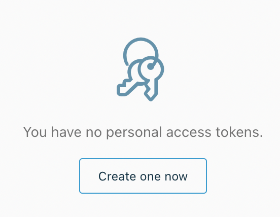
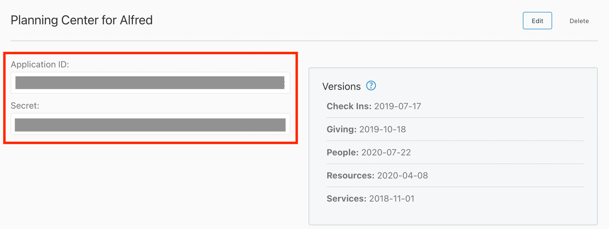
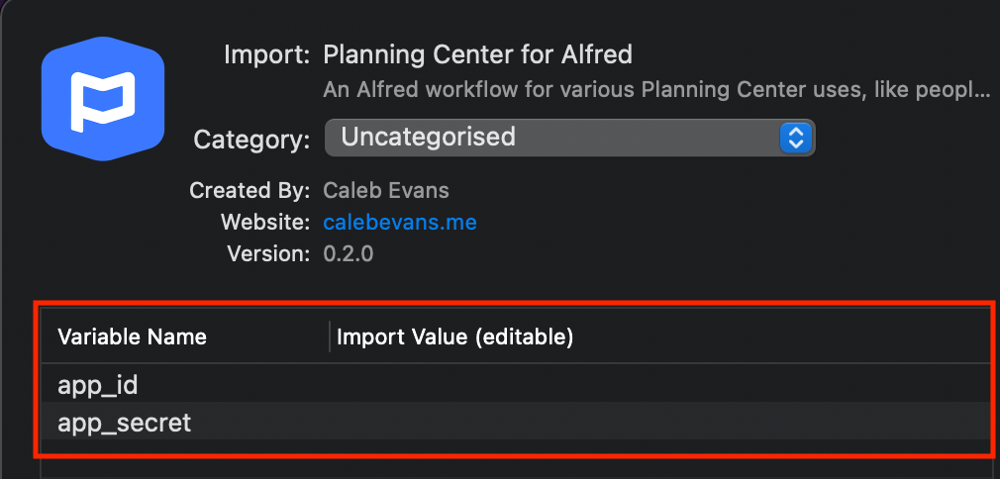

# Planning Center for Alfred

*Copyright 2021 Caleb Evans*  
*Released under the MIT license*

Planning Center for Alfred is an Alfred 4 workflow designed to help churches
with various Planning Center functions, like searching for people.

## Connecting to your Planning Center account

### 1. Generate Personal Access Token

1. Visit https://api.planningcenteronline.com/oauth/applications (log in if prompted)
2. Scroll down the page to the **Personal Access Tokens** section
3. Click the **Create one now** button
4. Copy the **Application ID** and **Secret**; save them to a safe place

Do not share the Application ID and Secret with anyone. Together, they grant
access to your entire Planning Center account, so they should be handled with
great care.

### 2. Enter ID and Secret into workflow

When you first import the workflow into Alfred, you'll have the opportunity to
paste the ID and Secret generated in the previous step.

## Usage

### Search for People

To search for people, use the `pcp` command. For example, `pcp caleb` will
search the people in your Planning Center account for `caleb`.
