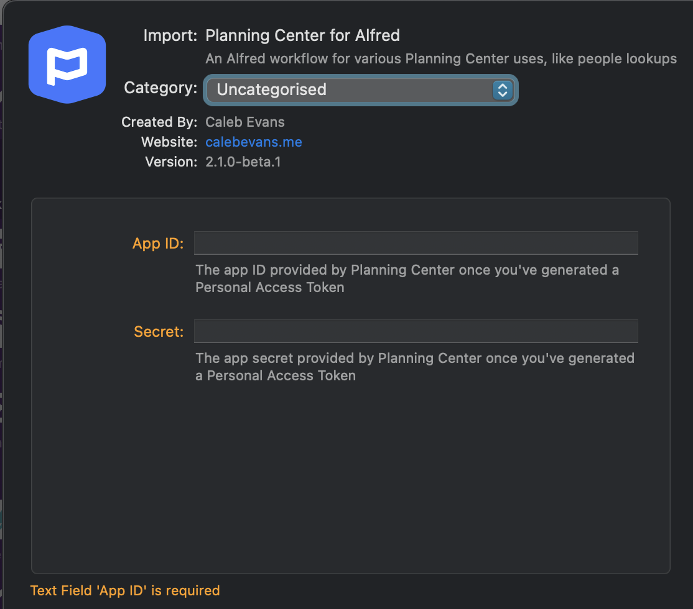

# Planning Center for Alfred

*Copyright 2021-2023 Caleb Evans*  
*Released under the MIT license*

Planning Center for Alfred is an Alfred 5 workflow designed to help churches
with various Planning Center functions, like searching for people.

## Connecting to your Planning Center account

### 1. Generate Personal Access Token

1. Visit https://api.planningcenteronline.com/oauth/applications (log in if prompted)
2. Scroll down the page to the **Personal Access Tokens** section
3. Click the **Create one now** button
4. Copy the **Application ID** and **Secret**; save them to a safe place

Do not share the Application ID and Secret with anyone. Together, they grant
access to your entire Planning Center account, so they should be handled with
great care.

### 2. Enter ID and Secret into workflow

When you first import the workflow into Alfred ([download here][download]),
you'll have the opportunity to paste the ID and Secret generated from the
previous step.

[download]: https://github.com/caleb531/planning-center-alfred/raw/master/Planning%20Center%20for%20Alfred.alfredworkflow

## Usage

### Search for people

To search for people, use the `pcp` command. You can search by name, phone
number, or email address.

#### Examples

- `pcp caleb`
- `pcp caleb@calebevans.me`
- `pcp 123-456-7890`

#### Copy to clipboard

When searching for people via the `pcp` command, holding down the `command` key
while choosing a result will copy the person's phone number to the clipboard.
Similarly, holding down the `option` key while choosing a result will copy the
person's email address.
